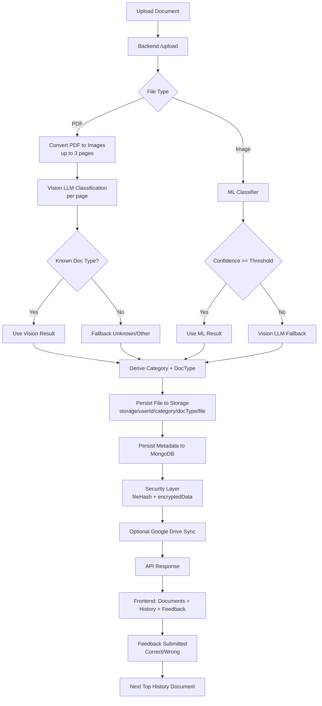

# CareerVault

CareerVault is an AI-powered **Career Memory System** that classifies, stores, and organizes uploaded career assets (Resumes, Certificates, Projects, etc.) into structured folders and extracts factual data into a searchable Knowledge Graph for intelligent reasoning.

## What Is Included

- **Knowledge Graph Integration**: Extracts career memories (skills, experience, projects) via Cognee to build semantic graphs.
- **Intelligent Career Assistant**: GuideBot leverages semantic graph context to provide deeply personalized answers about your portfolio.
- **Graph Visualization**: Explore your career memory topology (nodes, edges, and connections) directly from the UI.
- Hybrid classification path with confidence-based fallback
- Category-aware storage (`Resume`, `Certificate`, `Internship`, `Professional`, `Academic`, `Achievement`, `Project`, `Other`)
- Auto folder creation by category and document type
- History and document explorer with category filtering and search
- Feedback flow for top history item (`Correct` / `Wrong`)
- Optional Google Drive auto-sync
- Security extensions: auth middleware, encrypted extracted payload storage, file hash integrity, secure file access route

## System Flow



## Current Architecture

- Frontend: React + Vite + TypeScript
- Backend: Node.js + Express + MongoDB
- Classification: ML first, Vision LLM fallback for low confidence/unknown cases
- Storage: Local file system under user/category/doc-type path
- Auth: Clerk token verification (plus `x-user-id` compatibility path)

## Repository Layout

```
docs/          # Product docs, usage, architecture, contribution, conduct
careervault_main/
  backend/     # Express API, classification orchestration, storage sync, notifications
  frontend/    # React/Vite UI
  ml-service/  # Python services for model/OCR-related tasks
  storage/     # Persisted documents
```

## Quick Start

### 1. Install dependencies

From repository root:

```powershell
npm --prefix "careervault_main/backend" install
npm --prefix "careervault_main/frontend" install
```

### 2. Configure environment

Backend env:

- Copy `careervault_main/backend/.env.example` to `careervault_main/backend/.env`
- Set required values (`CLERK_SECRET_KEY`, `MONGO_URI`, `GROQ_API_KEY`, `DATA_ENCRYPTION_KEY`, etc.)

Frontend env:

- Set `VITE_BACKEND_URL` in `careervault_main/frontend/.env`
- Local default is usually `http://localhost:5000`

### 3. Start services

Backend:

```powershell
cd "careervault_main/backend"
npm start
```

Frontend:

```powershell
cd "careervault_main/frontend"
npm run dev
```

If port `5000` is already in use, stop the existing process first, then restart backend.

## Security Enhancements

- Middleware auth gate for protected routes
- Extracted payload encryption before DB write (`encryptedData`)
- SHA-256 integrity hash per stored file (`fileHash`)
- Secure file route with user-level access validation for authenticated requests
- Env-based secret handling (`DATA_ENCRYPTION_KEY` and related credentials)

## Category and Folder Behavior

- Backend now maps document output into targeted career paths (e.g. `Resume`, `Certificate`, `Internship`).
- Documents are organized cleanly within user-specific folders, no longer arbitrarily falling back to `Other`.
- UI category rendering prefers:
  1. `storage.category`
  2. `classification.category`
  3. `category`
  4. fallback `Other`

## Troubleshooting

### Backend does not start (`EADDRINUSE` on 5000)

```powershell
$conn = Get-NetTCPConnection -LocalPort 5000 -State Listen -ErrorAction SilentlyContinue
if ($conn) { Stop-Process -Id $conn.OwningProcess -Force }
cd "careervault_main/backend"
npm start
```

### UI still shows old category/result

- Ensure backend is running latest code (not stale node process)
- Re-upload document after backend restart
- Hard refresh frontend browser tab
- Verify `VITE_BACKEND_URL` points to active backend

## Additional Documentation

For full onboarding and operations details, see [docs/README.md](docs/README.md).

The docs folder includes product rationale, how to use CareerVault, system architecture, flow diagrams, and community guidelines.
