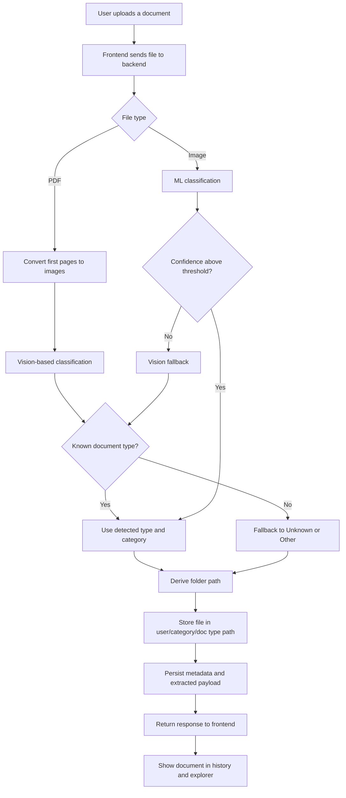
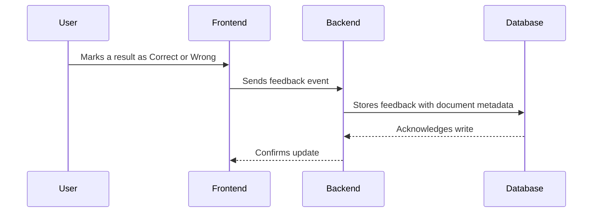

# Architecture and Flows

This page describes how ParseFlow moves a document from upload to storage and review.

## High-Level Architecture

- Frontend: user upload, history, filtering, and feedback
- Backend: request validation, classification orchestration, storage, metadata persistence, and sync
- ML service: OCR and model-backed support for image/document classification
- Storage: files organized by user, category, and document type
- Database: metadata, history, and extracted payloads

## Main Upload Flow

## Storage Flow

## Feedback Loop

## Design Intent

- Prefer deterministic storage paths so files are predictable.
- Use fallback classification so unknown documents still get handled.
- Keep metadata separate from file storage so history and search stay fast.
- Preserve a feedback path so the app can show corrections instead of hiding uncertainty.
